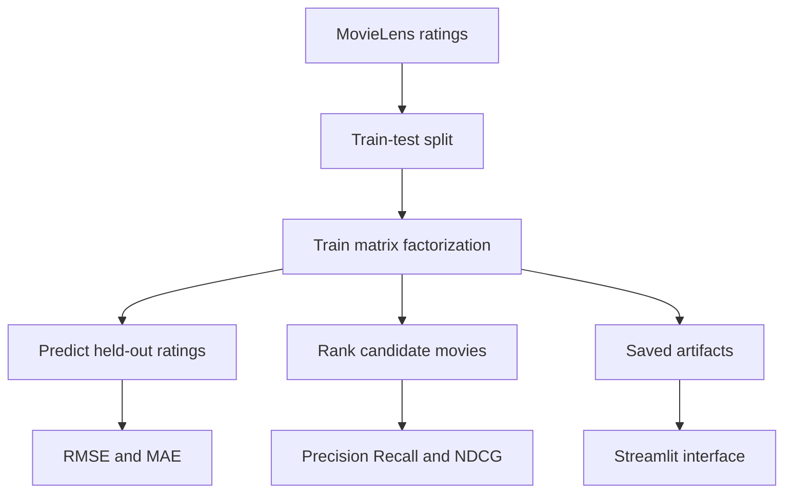

# Movie Recommender with Matrix Factorization

An educational recommender-system implementation that learns user and movie representations from explicit MovieLens ratings.

The project implements bias-aware matrix factorization with NumPy, trains it using stochastic gradient descent, evaluates rating prediction and top-K ranking behavior, saves model artifacts, and exposes recommendations through a Streamlit interface.

> **Evaluation note:** The results below are from one reported experiment. Their interpretation depends on the data split, relevance threshold, candidate set, exclusion of training items, and aggregation method. They should not be treated as general performance claims without a fully reproducible evaluation protocol and baseline comparisons.

## Motivation

Recommendation systems must learn from a user-item matrix in which most ratings are missing. I built this project to understand the mechanics of collaborative filtering without relying on a recommender-system library that hides model training and ranking logic.

The project explores:

- Representing users and movies with latent vectors.
- Incorporating global, user, and movie rating biases.
- Optimizing parameters with stochastic gradient descent.
- Separating rating-prediction metrics from ranking metrics.
- Generating recommendations for unrated movies.
- Persisting trained artifacts for an interactive application.

## Model

For user $u$ and movie $i$, the predicted rating is:

$$
\hat{r}_{ui} = \mu + b_u + b_i + p_u^Tq_i
$$

where:

- $\mu$ is the global mean rating.
- $b_u$ is the learned user bias.
- $b_i$ is the learned movie bias.
- $p_u$ is the user's latent vector.
- $q_i$ is the movie's latent vector.

The parameters are trained on observed ratings by minimizing squared prediction error with L2 regularization:

$$
\mathcal{L} = \sum_{(u,i) \in \Omega}
(r_{ui} - \hat{r}_{ui})^2
+ \lambda
(\lVert p_u \rVert^2 + \lVert q_i \rVert^2 + b_u^2 + b_i^2)
$$

Here, $\Omega$ is the set of observed user-movie ratings and $\lambda$ controls regularization.

## Pipeline



## Implemented Components

- Explicit-feedback collaborative filtering
- User and movie latent factors
- Global, user, and movie bias terms
- Stochastic-gradient-descent training
- L2 regularization
- Top-N recommendation generation
- RMSE and MAE calculation
- Precision@K, Recall@K, and NDCG@K calculation
- Per-user metric distributions
- Serialized model artifacts
- Streamlit recommendation browser

The core matrix-factorization training logic is implemented directly rather than through Surprise, LightFM, or a similar recommender framework.

## Dataset

The project uses the [MovieLens 100K dataset](https://grouplens.org/datasets/movielens/100k/), which contains 100,000 explicit ratings from 943 users for 1,682 movies.

Place the extracted dataset under:

```text
data/ml-100k/
```

The training script expects MovieLens files such as `u.data` to be available in that directory.

Review the dataset's usage terms before redistributing its files.

## Repository Structure

```text
Movie-Recommender-Matrix-Factorization/
├── artifacts/
├── data/
│   └── ml-100k/
├── src/
│   ├── train_and_recommend.py
│   └── streamlit_app.py
└── README.md
```

| Path | Purpose |
| --- | --- |
| `src/train_and_recommend.py` | Trains the model, evaluates it, and writes artifacts |
| `src/streamlit_app.py` | Displays recommendations for a selected user |
| `data/ml-100k/` | Local MovieLens dataset files |
| `artifacts/` | Trained parameters, metadata, metrics, and generated plots |

Generated artifacts should record the code version, hyperparameters, random seed, split definition, and dataset version that produced them.

## Setup

### Prerequisites

- Python 3.9 or later
- Sufficient memory to rank the MovieLens candidate set

Clone the repository:

```bash
git clone https://github.com/dhyanagni2001-commits/Movie-Recommender-Matrix-Factorization.git
cd Movie-Recommender-Matrix-Factorization
```

Create and activate a virtual environment:

```bash
python3 -m venv .venv
source .venv/bin/activate
```

On Windows PowerShell:

```powershell
py -m venv .venv
.venv\Scripts\Activate.ps1
```

Install the main dependencies:

```bash
python -m pip install numpy pandas scikit-learn matplotlib streamlit
```

For reproducible setup, the repository should include a pinned `requirements.txt` or another dependency-lock file.

## Training and Evaluation

After placing MovieLens 100K in `data/ml-100k/`, run:

```bash
cd src
python train_and_recommend.py
```

The script trains the model, calculates the configured metrics, and writes reusable files under `artifacts/`.

Generated visualizations may include:

```text
precision_at_10_hist.png
recall_at_10_hist.png
ndcg_at_10_hist.png
```

These plots show variation across evaluated users. They should be read together with the number of eligible users and the exact relevance definition.

## Streamlit Interface

From the repository root, run:

```bash
streamlit run src/streamlit_app.py
```

The interface allows a user ID and recommendation-list length to be selected and displays the model's highest-ranked candidate movies.

The interface demonstrates artifact loading and inference. It is not an online personalization system and does not collect new feedback or retrain the model from user activity.

## Reported Results

The repository reports the following approximate values from a training run:

### Rating Prediction

| Metric | Reported value |
| --- | ---: |
| RMSE | 0.94 |
| MAE | 0.74 |

### Top-K Ranking

| K | Precision@K | Recall@K | NDCG@K |
| ---: | ---: | ---: | ---: |
| 5 | 0.030 | 0.010 | 0.028 |
| 10 | 0.046 | 0.028 | 0.042 |
| 20 | 0.048 | 0.067 | 0.055 |

The values show that recall increased as the recommendation list became longer in this run. They do not, by themselves, establish whether the model performs well.

For a defensible comparison, the experiment must document:

- How ratings were divided into training and test sets
- Whether the split was random, per-user, or chronological
- Which rating values were considered relevant
- Whether movies observed during training were excluded from recommendation candidates
- Whether ranking covered all unseen movies or sampled negatives
- Which users were excluded from metric calculation
- Whether metrics were macro- or micro-averaged
- The random seed and hyperparameters
- Results for non-personalized and bias-only baselines

## Metric Interpretation

### RMSE and MAE

RMSE and MAE measure error on held-out rating predictions. RMSE penalizes large errors more heavily. Neither metric directly measures whether the best movies appear near the top of a recommendation list.

### Precision@K

Precision@K measures the fraction of the first $K$ recommendations that satisfy the experiment's relevance rule. Its magnitude changes with the relevance threshold and candidate protocol.

### Recall@K

Recall@K measures the fraction of a user's held-out relevant movies that appear in the first $K$ recommendations. Recall commonly increases with $K$ because the model is allowed to return more items.

### NDCG@K

NDCG@K gives more credit when relevant items appear earlier. Its implementation must state whether relevance is binary or graded and how users without eligible relevant items are handled.

## Recommended Baselines

At minimum, compare the model with:

- Global-mean rating prediction
- Global mean with user and movie biases
- Most-popular unseen movies
- User- or item-based nearest-neighbor collaborative filtering
- Random ranking as a ranking sanity check

Reporting a baseline under the same split and candidate protocol makes the model's contribution interpretable.

## Design Tradeoffs

### Manual Matrix Factorization

Implementing training directly makes gradient updates and regularization easy to inspect. It provides fewer optimizations, diagnostics, and safeguards than a maintained recommender library.

### Explicit Feedback

Ratings express preference intensity but are sparse and subject to selection bias because users rate only a small, non-random subset of movies. Many deployed recommenders instead learn from implicit events such as views and clicks.

### Pointwise Squared-Error Loss

Squared error directly optimizes rating prediction. It does not directly optimize the ordering of the top recommendations; pairwise ranking losses may align more closely with ranking objectives.

### Random Interaction Split

If interactions are split randomly, evaluation is simple and gives each side broad coverage. A chronological split more closely represents recommending future items from past behavior and avoids using later activity to predict earlier activity.

### Saved Model Artifacts

Persisting trained factors makes the Streamlit application faster to start. Artifacts can become incompatible or misleading when preprocessing, ID mappings, or model code changes unless they are versioned.

## Known Limitations

- The README does not fully specify the evaluation protocol used for the reported metrics.
- Results are not compared with baselines under the same protocol.
- A single split does not show variability across random seeds.
- Matrix factorization cannot recommend reliably for unseen users or movies.
- Movie metadata is not used to address cold start.
- Explicit ratings contain observation and selection bias.
- The training objective optimizes rating error rather than ranking quality.
- The Streamlit interface supports offline demonstration rather than online learning.
- Automated tests and continuous integration are not documented.
- A virtual environment is currently committed to the repository.

## Repository Cleanup

Before presenting the project:

- Remove `venv/` from version control.
- Add `.venv/`, `venv/`, caches, and generated local files to `.gitignore`.
- Add a pinned dependency file.
- Confirm that artifacts can be recreated from a clean checkout.
- Avoid committing dataset files unless their redistribution terms permit it.
- Add the exact experiment configuration beside every reported result.

## Possible Improvements

- Add popularity and bias-only baselines.
- Add deterministic per-user or chronological data splitting.
- Evaluate across multiple seeds and report mean and standard deviation.
- Add hyperparameter search without using the test set for selection.
- Add ranking losses such as Bayesian Personalized Ranking.
- Add movie genres and metadata for a hybrid cold-start model.
- Add unit tests for prediction, exclusion, ranking, and metric calculations.
- Add continuous integration for tests and reproducible training checks.
- Version the model, preprocessing logic, and ID mappings together.
- Add an evaluation report generated from a single configuration file.

## What I Learned

This project helped me understand how latent-factor recommenders learn user and item representations, how bias terms affect rating predictions, and how regularization controls model capacity.

It also demonstrated why recommender evaluation is sensitive to experimental design. RMSE, Precision@K, Recall@K, and NDCG@K describe different behaviors, and their values are meaningful only when the split, relevance rule, candidate set, baselines, and aggregation procedure are clearly defined.
